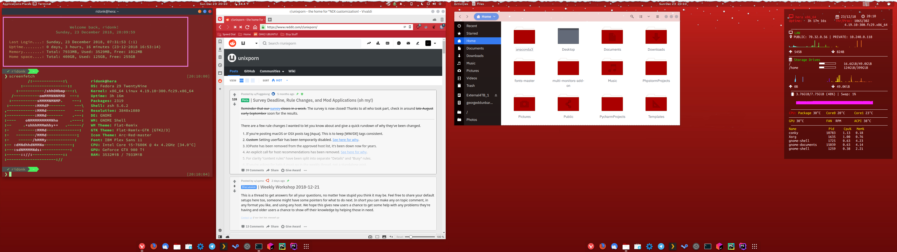
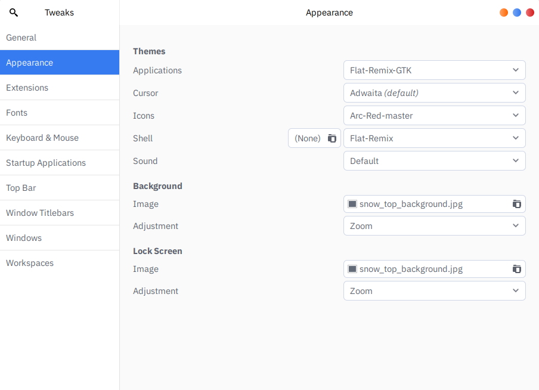

# Config Files for Ridonk's Christmas Desktop

Note: This repo only includes config files and relevant themes should be downloaded as per directions below.

## Install

### Prerequisites

Install the following themes and tools following the instructions on their pages:

1. [ZSH and Oh_my_ZSH](https://github.com/robbyrussell/oh-my-zsh)
2. [VIM Awesome](https://github.com/vim-awesome/vim-awesome)
3. [Flat Remix GTK](https://github.com/daniruiz/flat-remix-gtk)
4. [Arc Red](https://github.com/terroreek/Arc-Red)
5. [Conky Icons by Carelli](https://github.com/antoniocarelli/conky)
6. [Conky](https://github.com/brndnmtthws/conky)
7. [Gogh Terminal Themes](https://github.com/Mayccoll/Gogh) - Note, this is optional as I modified one of themes in this to make the one used in my desktop and have included it in the repo. It's still worth taking a look at their work, though!

### Installing configs and picking themes

Download and extract this repo to your home folder (this readme can be deleted).

To install the gnome-terminal configs run the following from a terminal in your home directory:

`dconf load /org/gnome/terminal/legacy/profiles:/ < gnome-terminal-profiles.dconf`

The used theme is Red Alert - Christmas

Use gnome-tweaks to change gnome themes to following:

Enjoy!

## Permissions
Feel free to use and modify these files in any way without credit to me, but please credit the above authors for their work according to their respective licenses if you use any of their tools. If anyone has issues with my repo, please reach out so I can resolve it!

## Credits

All credit for included files goes to their original creators. I've only made small edits to bring things together.
